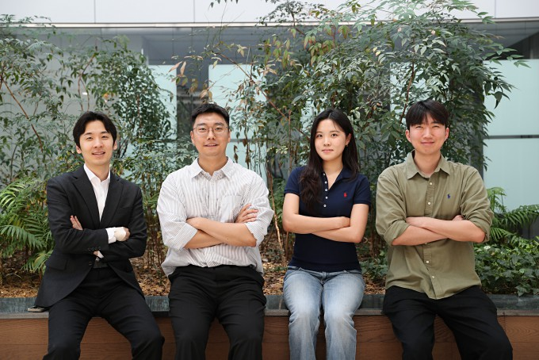
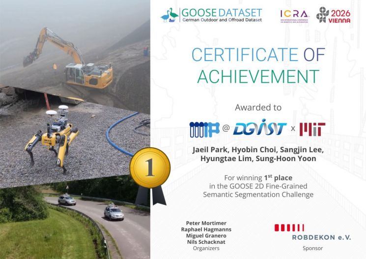

## 1st Place at ICRA 2026 Workshop on Field Robotics

The DGIST–MIT joint research team placed **1st among 56 international teams** in the GOOSE 2D Fine-Grained Semantic Segmentation Challenge at ICRA 2026.

The team was led by **Professor Sung-Hoon Yoon** and included **Jaeil Park, Hyobin Choi, and Sangjin Lee**, with co-advising from **Dr. Hyungtae Lim** of the MIT SPARK Lab.

## Key Achievement

The challenge evaluated semantic segmentation across **64 fine-grained classes** in complex, unstructured outdoor environments. The team combined **DINOv3** with **Mask2Former** to improve robust scene understanding, particularly for rare objects with limited training data.

  <figure>
    
    <!-- <figcaption>First place at the ICRA 2026 GOOSE Challenge.</figcaption> -->
  </figure>
  <figure>
    
    <!-- <figcaption>Professor Sung-Hoon Yoon, Sangjin Lee, Hyobin Choi, and Jaeil Park.</figcaption> -->
  </figure>

The technology can support autonomous vehicles, disaster-response robots, smart agriculture, and construction-site robots operating in challenging outdoor environments.

## Media Coverage

<a class="media-link" href="https://www.asiae.co.kr/en/article/2026060907515545005" target="_blank" rel="noopener">Read the original article →</a>
